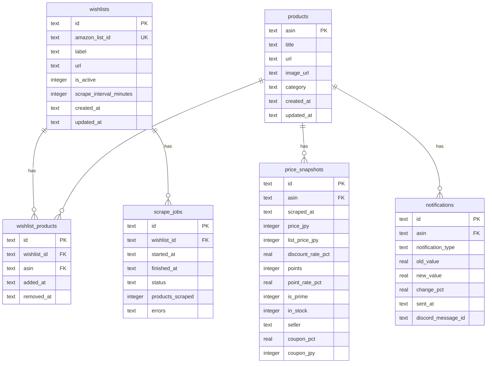

# データモデル

## ER 図



---

## テーブル定義

### `wishlists`

追跡対象の Amazon.co.jp ウィッシュリスト。

| カラム | 型 | 制約 | 説明 |
|---|---|---|---|
| `id` | TEXT | PK | UUID v4 |
| `amazon_list_id` | TEXT | UNIQUE NOT NULL | Amazon の内部リスト ID (URL から抽出) |
| `label` | TEXT | NOT NULL | ユーザーが設定する表示名 |
| `url` | TEXT | NOT NULL | Amazon.co.jp ウィッシュリスト URL |
| `is_active` | INTEGER | NOT NULL DEFAULT 1 | 1=スクレイプ有効, 0=停止 |
| `scrape_interval_minutes` | INTEGER | NOT NULL DEFAULT 360 | スクレイプ間隔 (分) |
| `created_at` | TEXT | NOT NULL | ISO-8601 タイムスタンプ |
| `updated_at` | TEXT | NOT NULL | ISO-8601 タイムスタンプ |

### `products`

Amazon.co.jp の商品マスタ。スクレイプ時に UPSERT される。

| カラム | 型 | 制約 | 説明 |
|---|---|---|---|
| `asin` | TEXT | PK | Amazon 商品識別子 (10文字英数字) |
| `title` | TEXT | NOT NULL | 商品名 |
| `url` | TEXT | NOT NULL | 商品ページ URL (`/dp/{ASIN}`) |
| `image_url` | TEXT | | サムネイル画像 URL |
| `category` | TEXT | | 商品カテゴリ (e.g. "本") |
| `created_at` | TEXT | NOT NULL | |
| `updated_at` | TEXT | NOT NULL | 最後にメタデータが更新された日時 |

### `wishlist_products`

ウィッシュリストと商品の多対多中間テーブル。

| カラム | 型 | 制約 | 説明 |
|---|---|---|---|
| `id` | TEXT | PK | UUID v4 |
| `wishlist_id` | TEXT | FK → wishlists.id | |
| `asin` | TEXT | FK → products.asin | |
| `added_at` | TEXT | NOT NULL | ウィッシュリストに最初に現れた日時 |
| `removed_at` | TEXT | | NULL = まだリストにある |

**ユニーク制約**: `(wishlist_id, asin)`

### `price_snapshots`

スクレイプのたびに 1 行挿入されるコア時系列テーブル。

| カラム | 型 | 制約 | 説明 |
|---|---|---|---|
| `id` | TEXT | PK | UUID v4 |
| `asin` | TEXT | FK NOT NULL | |
| `scraped_at` | TEXT | NOT NULL | スクレイプ実行日時 (ISO-8601) |
| `price_jpy` | INTEGER | | 現在価格 (円)。NULL = 取得不可 |
| `list_price_jpy` | INTEGER | | 参考価格・定価 (円) |
| `discount_rate_pct` | REAL | | 値引率 (%)。`(list_price - price) / list_price * 100` |
| `points` | INTEGER | | 付与ポイント数 |
| `point_rate_pct` | REAL | | ポイント還元率 (%)。`points / price * 100` |
| `is_prime` | INTEGER | NOT NULL DEFAULT 0 | 1 = Prime 価格 |
| `in_stock` | INTEGER | NOT NULL DEFAULT 1 | 0 = 在庫切れ |
| `seller` | TEXT | | 販売者名 |
| `coupon_pct` | REAL | | クリップクーポン割引率 (%) |
| `coupon_jpy` | INTEGER | | クリップクーポン固定値引き額 (円) |

**インデックス**: `(asin, scraped_at DESC)` — 最新スナップショット取得の高速化

### `notifications`

Discord に送信した通知の監査ログ。クールダウン判定にも使用。

| カラム | 型 | 制約 | 説明 |
|---|---|---|---|
| `id` | TEXT | PK | UUID v4 |
| `asin` | TEXT | FK NOT NULL | |
| `notification_type` | TEXT | NOT NULL | 通知種別 (下記参照) |
| `old_value` | REAL | | 変化前の値 |
| `new_value` | REAL | | 変化後の値 |
| `change_pct` | REAL | | 変化率 (%) |
| `sent_at` | TEXT | NOT NULL | 通知送信日時 |
| `discord_message_id` | TEXT | | Discord メッセージ ID (将来の編集用) |

**notification_type の値**:
- `price_drop` — 価格下落
- `price_rise` — 価格上昇
- `new_discount` — 新たに値引き開始
- `point_change` — ポイント変動
- `back_in_stock` — 在庫復活
- `out_of_stock` — 在庫切れ

### `scrape_jobs`

スクレイプ実行履歴。可観測性と障害調査に使用。

| カラム | 型 | 制約 | 説明 |
|---|---|---|---|
| `id` | TEXT | PK | UUID v4 |
| `wishlist_id` | TEXT | FK NOT NULL | |
| `started_at` | TEXT | NOT NULL | ジョブ開始日時 |
| `finished_at` | TEXT | | NULL = まだ実行中 |
| `status` | TEXT | NOT NULL DEFAULT 'running' | `running` / `success` / `partial` / `failed` |
| `products_scraped` | INTEGER | NOT NULL DEFAULT 0 | 成功したスクレイプ数 |
| `errors` | TEXT | | エラーメッセージの JSON 配列 |

---

## データ保持ポリシー (推奨)

- `price_snapshots`: 直近 90 日分を保持、それ以前は月次集計に圧縮
- `scrape_jobs`: 30 日分を保持
- `notifications`: 無期限 (監査ログとして)

D1 のストレージ制限に応じて、Worker で定期的なクリーンアップジョブを実装することを推奨します。

---

## マイグレーション運用

```bash
# ローカル D1 にマイグレーション適用
pnpm --filter @tsundoku-tools/db run db:migrate:local

# リモート D1 にマイグレーション適用 (本番)
pnpm --filter @tsundoku-tools/db run db:migrate:remote

# スキーマ変更後にマイグレーションファイルを生成
pnpm --filter @tsundoku-tools/db run db:generate
```

マイグレーションファイルは `packages/db/src/migrations/` に格納され、`apps/api/wrangler.toml` と `apps/scraper-worker/wrangler.toml` で `migrations_dir` として参照されます。
